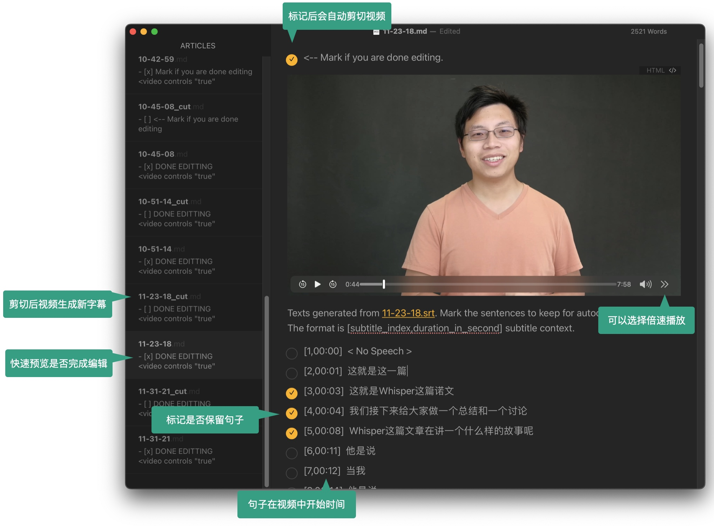
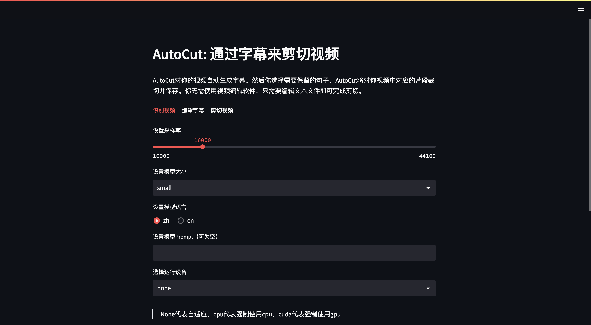

# AutoCut: 通过字幕来剪切视频

AutoCut对你的视频自动生成字幕。然后你选择需要保留的句子，AutoCut将对你视频中对应的片段裁切并保存。你无需使用视频编辑软件，只需要编辑文本文件即可完成剪切。

## 使用例子

假如你录制的视频放在 `2022-11-04/` 这个文件夹里。那么运行

```bash
autocut -d 2022-11-04
```

> 提示：如果你使用OBS录屏，可以在 `设置->高级->录像->文件名格式` 中将空格改成`/`，既 `%CCYY-%MM-%DD/%hh-%mm-%ss`。那么视频文件将放在日期命名的文件夹里。

AutoCut将持续对这个文件夹里视频进行字幕抽取和剪切。例如，你刚完成一个视频录制，保存在 `11-28-18.mp4`。AutoCut将生成 `11-28-18.md`。你在里面选择需要保留的句子后，AutoCut将剪切出 `11-28-18_cut.mp4`，并生成 `11-28-18_cut.md` 来预览结果。

你可以使用任何的Markdown编辑器。例如我常用VS Code和Typora。下图是通过Typora来对 `11-28-18.md` 编辑。



全部完成后在 `autocut.md` 里选择需要拼接的视频后，AutoCut将输出 `autocut_merged.mp4` 和对应的字幕文件。

## 安装

首先安装 Python 包

```
pip install git+https://github.com/mli/autocut.git
```

> 上面将安装 [pytorch](https://pytorch.org/)。如果你需要GPU运行，且默认安装的版本不匹配的话，你可以先安装Pytorch。如果安装 Whipser 出现问题，请参考[官方文档](https://github.com/openai/whisper#setup)。

另外需要安装 [ffmpeg](https://ffmpeg.org/)

```
# on Ubuntu or Debian
sudo apt update && sudo apt install ffmpeg

# on Arch Linux
sudo pacman -S ffmpeg

# on MacOS using Homebrew (https://brew.sh/)
brew install ffmpeg

# on Windows using Scoop (https://scoop.sh/)
scoop install ffmpeg
```

## Docker安装  

首先将项目克隆到本地。  

```bash
git clone https://github.com/mli/autocut.git
```

### 安装CPU版本  

进入项目根目录，然后构建docker映像。  

```bash
docker build -t autocut .
```

运行下面的命令创建docker容器，就可以直接使用了。

```bash
docker run -it --rm -v E:\autocut:/autocut/video autocut /bin/bash
```

其中`-v`是将主机存放视频的文件夹`E:\autocut`映射到虚拟机的`/autocut/video`目录。`E:\autocut`是主机存放视频的目录，需修改为自己主机存放视频的目录。  

### 安装GPU版本

使用GPU加速需要主机有Nvidia的显卡并安装好相应驱动。然后在项目根目录，执行下面的命令构建docker映像。

```bash
docker build -f ./Dockerfile.cuda -t autocut-gpu .
```

使用GPU加速时，运行docker容器需添加参数 `--gpus all`。

```bash
docker run --gpus all -it --rm -v E:\autocut:/autocut/video autocut-gpu
```

## 基于 streamlit 制作的网页使用

```shell
autocut-gui
```

具体步骤见对应的[README](./autocut/interface/README.md)。




## 更多使用选项

### 转录某个视频生成`.srt`和`.md`结果。

```bash
autocut -t 22-52-00.mp4
```

1. 如果对转录质量不满意，可以使用更大的模型，例如

    ```bash
    autocut -t 22-52-00.mp4 --whisper-model large
    ```

    默认是`small`。更好的模型是`medium`和`large`，但推荐使用GPU获得更好的速度。也可以使用更快的`tiny`和`base`，但转录质量会下降。

2. 如果你视频中有较多的长停顿，可以用`--vad`来使用格外的VAD模型预先识别这些停顿，使得对时间戳识别更准确。


### 剪切某个视频

```bash
autocut -c 22-52-00.mp4 22-52-00.srt 22-52-00.md
```

1. 默认视频比特率是 `--bitrate 10m`，你可以根据需要调大调小。
2. 如果不习惯Markdown文件，你也可以直接在`srt`文件里删除不要的句子，在剪切时不传入`md`文件名即可。就是 `autocut -c 22-52-00.mp4 22-52-00.srt`
3. 如果仅有`srt`文件，编辑不方便可以使用如下命令生成`md`文件，然后编辑`md`文件即可，但此时会完全对照`srt`生成，不会出现`no speech`等提示文本。

   ```bash
   autocut -m test.srt test.mp4
   autocut -m test.mp4 test.srt # 支持视频和字幕乱序传入
   autocut -m test.srt # 也可以只传入字幕文件
   ```


### 一些小提示


1. 讲得流利的视频的转录质量会高一些，这因为是Whisper训练数据分布的缘故。对一个视频，你可以先粗选一下句子，然后在剪出来的视频上再剪一次。

2. ~~最终视频生成的字幕通常还需要做一些小编辑。你可以直接编辑`md`文件（比`srt`文件更紧凑，且嵌入了视频）。然后使用 `autocut -s 22-52-00.md 22-52-00.srt` 来生成更新的字幕 `22-52-00_edited.srt`。注意这里会无视句子是不是被选中，而是全部转换成`srt`。~~

3. 最终视频生成的字幕通常还需要做一些小编辑。但`srt`里面空行太多。你可以使用 `autocut -s 22-52-00.srt` 来生成一个紧凑些的版本 `22-52-00_compact.srt` 方便编辑（这个格式不合法，但编辑器，例如VS Code，还是会进行语法高亮）。编辑完成后，`autocut -s 22-52-00_compact.srt` 转回正常格式。

4. 用Typora和VS Code编辑markdown都很方便。他们都有对应的快捷键mark一行或者多行。但VS Code视频预览似乎有点问题。

5. 视频是通过ffmpeg导出。在Apple M1芯片上它用不了GPU，导致导出速度不如专业视频软件。

### 常见问题

1. **输出的是乱码？**

   AutoCut 默认输出编码是 `utf-8`. 确保你的编辑器也使用了`utf-8`解码。你可以通过`--encoding`指定其他编码格式。但是需要注意生成字幕文件和使用字幕文件剪辑时的编码格式需要一致。例如使用 `gbk`.

    ```bash
    autocut -t test.mp4 --encoding=gbk
    autocut -c test.mp4 test.srt test.md --encoding=gbk
    ```

    如果使用了其他编码格式（如gbk等）生成md文件并用Typora打开后，该文件可能会被Typora自动转码为其他编码格式，此时再通过生成时指定的编码格式进行剪辑时可能会出现编码不支持等报错。因此可以在使用Typora编辑后再通过VS Code等修改到你需要的编码格式进行保存后再使用剪辑功能。

2. **如何使用GPU来转录？**

   当你有Nvidia GPU，而且安装了对应版本的Pytorch的时候，转录是在GPU上进行。你可以通过命令来查看当前是不是支持GPU。

   ```bash
   python -c "import torch; print(torch.cuda.is_available())"
   ```

   否则你可以在安装autocut前手动安装对应的GPU版本Pytorch。

3. **使用GPU是报错显存不够。**

   whisper的大模型需要一定的GPU显存。如果你的显存不够，你可以用小一点的模型，例如`small`。如果你仍然想用大模型，可以通过`--device`来强制使用`cpu`。例如

   ```bash
   autocut -t 11-28-18.mp4 --whisper-model large --device cpu
   ```

4. **能不能直接用 `pip install autocut` 安装?**

   因为autocut的依赖whisper没有发布pypi包，所以目前只能用 `pip install git+https://github.com/mli/autocut.git` 这种方式发布。有需求的同学可以查看whisper模型是不是能直接在 huggingface hub 下载，从而摆脱whisper包的依赖。


## 如何参与贡献

[这里有一些想做的feature](https://github.com/mli/autocut/issues/22)，欢迎贡献

### 代码结构
```text
autocut
│  .gitignore
│  LICENSE
│  README.md # 一般新增或修改需要让使用者知道就需要对应更新 README.md 内容
│  setup.py
│
└─autocut # 核心代码位于 autocut 文件夹中，新增功能的实现也一般在这里面进行修改或新增
   │  cut.py
   │  daemon.py
   │  main.py
   │  transcribe.py
   │  utils.py
   └─ __init__.py

```

### 安装依赖
开始安装这个项目的需要的依赖之前，建议先了解一下 Anaconda 或者 venv 的虚拟环境使用，推荐**使用虚拟环境来搭建该项目的开发环境**。
具体安装方式为在你搭建搭建的虚拟环境之中按照[上方安装步骤](./README.md#安装)进行安装。

> 为什么推荐使用虚拟环境开发？
> 
> 一方面是保证各种不同的开发环境之间互相不污染。
> 
> 更重要的是在于这个项目实际上是一个 Python Package，所以在你安装之后 autocut 的代码实际也会变成你的环境依赖。
> **因此在你更新代码之后，你需要让将新代码重新安装到环境中，然后才能调用到新的代码。**

### 开发

1. 代码风格目前遵循 PEP-8，可以使用相关的自动格式化软件完成。
2. `utils.py` 主要是全局共用的一些工具方法。
3. `transcribe.py` 是调用模型生成`srt`和`md`的部分。
4. `cut.py` 提供根据标记后`md`或`srt`进行视频剪切合并的功能。
5. `daemon.py` 提供的是监听文件夹生成字幕和剪切视频的功能。
6. `main.py` 声明命令行参数，根据输入参数调用对应功能。

开发过程中请尽量保证修改在正确的地方，以及合理地复用代码，
同时工具函数请尽可能放在`utils.py`中。
代码格式目前是遵循 PEP-8，变量命名尽量语义化即可。

在开发完成之后，最重要的一点是需要进行**测试**，请保证提交之前对所有**与你修改直接相关的部分**以及**你修改会影响到的部分**都进行了测试，并保证功能的正常。
目前没有测试用例的CI，会在之后进行完善。

### 提交

1. commit 信息用英文描述清楚你做了哪些修改即可，小写字母开头。
2. 最好可以保证一次的 commit 涉及的修改比较小，可以简短地描述清楚，这样也方便之后有修改时的查找。
3. PR 的时候 title 简述有哪些修改， contents 可以具体写下修改内容。
4. run test `pip install pytest` then `pytest test`

