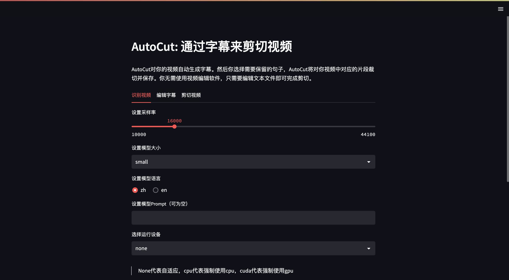
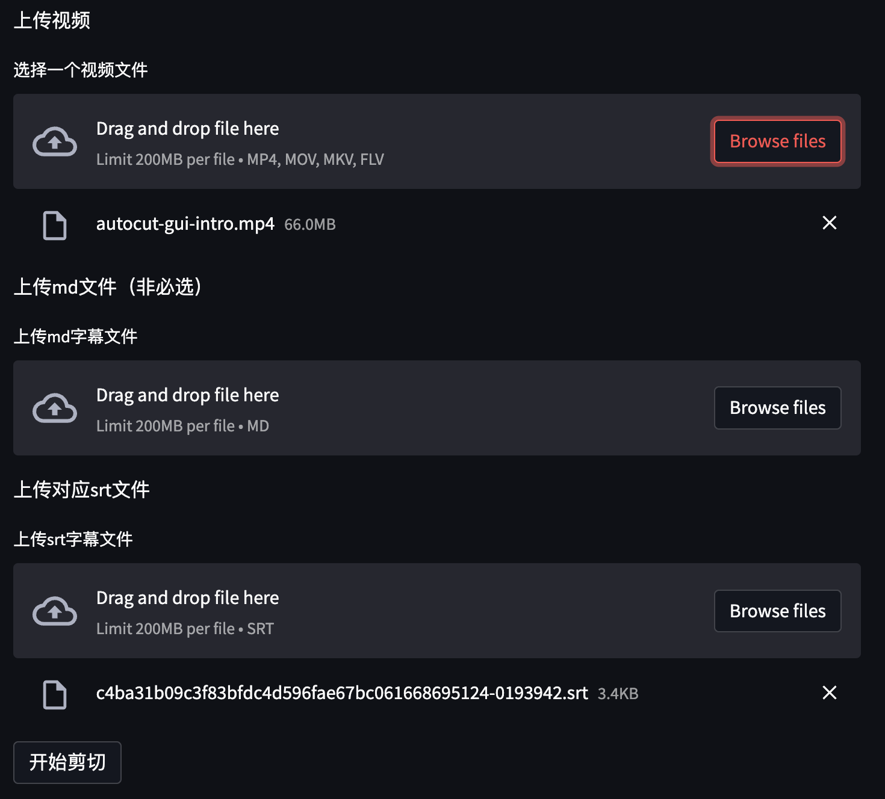

# 基于 streamlit 制作的 GUI 页面



## 启动

在完成安装之后，命令行输入如下指令即可：
```shell
autocut-gui
```

## 使用说明

### 视频识别

可以通过在页面上设置各种参数，并上传视频，生成对应的字幕`srt`和`md`文件，并进行下载。


### 字幕编辑

1. 可以在本地使用 markdown 编辑软件编辑`md`文件。
2. 也可以在字幕编辑页面进行编辑，选择删除不要的部分，并在完成后下载新的字幕文件。
3. 两种方式二选一即可。


### 剪切视频

1. 上传视频。
2. 如果使用的`md`文件进行的编辑，则需要上传编辑后的`md`文件和正常未编辑的`srt`文件。
3. 如果使用的`srt`文件进行的编辑，则只上传编辑后的`srt`文件即可。




## 视频演示

- [基于 streamlit 的 autocut 页面使用](https://www.bilibili.com/video/BV1zt4y1N77g/?share_source=copy_web&vd_source=c84b9680fa183b87741c5a276bf69f8d)
